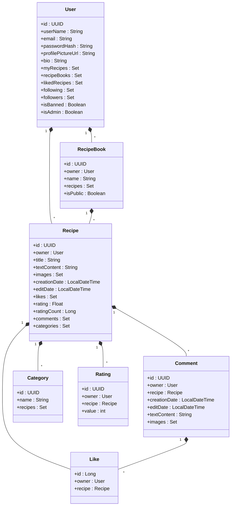

```mermaid
classDiagram
    User "1" *-- "*" Recipe
    User "1" *-- "*" RecipeBook

    RecipeBook "1" *-- "*" Recipe

    Recipe "1" *-- "" Like
    Recipe "1" *-- "*" Comment
    Recipe "1" *-- "*" Category
    Recipe "1" *-- "*" Rating

    Comment "1" *-- "*" Like

    class User {
        +id : UUID
        +userName : String
        +email : String
        +passwordHash : String
        +profilePictureUrl : String
        +bio : String
        +myRecipes : Set<Recipe>
        +recipeBooks : Set<RecipeBook>
        +likedRecipes : Set<Recipe>
        +following : Set<User>
        +followers : Set<User>
        +isBanned : Boolean
        +isAdmin : Boolean
    }

    class RecipeBook {
        +id : UUID
        +owner : User
        +name : String
        +recipes : Set<Recipe>
        +isPublic : Boolean
    }

    class Recipe {
        +id : UUID
        +owner : User
        +title : String
        +textContent : String
        +images : Set<String>
        +creationDate : LocalDateTime
        +editDate : LocalDateTime
        +likes : Set<Like>
        +rating : Float
        +ratingCount : Long
        +comments : Set<Comment>
        +categories : Set<Category>
    }

    class Like {
        +id : Long
        +owner : User
        +recipe : Recipe
    }

    class Comment {
        +id : UUID
        +owner : User
        +recipe : Recipe
        +creationDate : LocalDateTime
        +editDate : LocalDateTime
        +textContent : String
        +images : Set<String>
    }

    class Category {
        +id : UUID
        +name : String
        +recipes : Set<Recipe>
    }

    class Rating {
        +id : UUID
        +owner : User
        +recipe : Recipe
        +value : int
    }
```

```mermaid
classDiagram
    ViewFeedActivity --> RecipeService

    ViewRecipeActivity --> RecipeService
    ViewRecipeActivity --> CommentService
    ViewRecipeActivity --> LikeService
    ViewRecipeActivity --> UserService

    CreateRecipeActivity --> RecipeService
    CreateRecipeActivity --> CategoryService
    CreateRecipeActivity --> UserService

    CreateCommentActivity --> CommentService

    ViewProfileActivity --> UserService

    EditProfileActivity --> UserService

    RecipeBookActivity --> RecipeBookService
    RecipeBookActivity --> RecipeService

    SearchActivity --> CategoryService

    AuthActivity --> AuthService


    CategoryService <|-- CategoryServiceImplementation
    LikeService <|-- LikeServiceImplementation
    RecipeBookService <|-- RecipeBookServiceImplementation
    RecipeService <|-- RecipeServiceImplementation
    UserService <|-- UserServiceImplementation
    CommentService <|-- CommentServiceImplementation
    AuthService <|-- AuthServiceImplementation

    AuthServiceImplementation --> UserRepository
    CategoryServiceImplementation --> CategoryRepository
    CommentServiceImplementation --> CommentRepository
    LikeServiceImplementation --> LikeRepository
    LikeServiceImplementation --> RecipeRepository
    RecipeBookServiceImplementation --> RecipeBookRepository
    RecipeBookServiceImplementation --> RecipeRepository
    RecipeServiceImplementation --> RecipeRepository
    UserServiceImplementation --> UserRepository

    class ViewFeedActivity{
        -onCreate(savedInstanceState : Bundle?)
    }

    class SearchActivity{
        -onCreate(savedInstanceState : Bundle?)
    }

    class ViewRecipeActivity{
        -onCreate(savedInstanceState : Bundle?)
    }

    class CreateRecipeActivity{
        -recipeTextField : TextField

        -onCreate(savedInstanceState : Bundle?)
    }

    class CreateCommentActivity{
        -onCreate(savedInstanceState : Bundle?)
    }

    class ViewProfileActivity{
        -onCreate(savedInstanceState : Bundle?)
    }

    class EditProfileActivity{
        -onCreate(savedInstanceState : Bundle?)
    }

    class RecipeBookActivity{
        -onCreate(savedInstanceState : Bundle?)
    }

    class AuthActivity{
        -registerButton : Button
        -logInButton : Button

        -nameField : TextField
        -passwordField : TextField
        -emailField : TextField

        -onCreate(savedInstanceState : Bundle?)
        -onClick(v : View)
    }

    class CategoryService{
        <<interface>>

        createCategory(category : Category)
        deleteCategory(category : Category)
        findCategoryByID(id : UUID)
        findCategoryByName(name : String)
        getAllCategories(page : int, pageSize : int)
        getRecipesForCategory(categoryId : UUID)
        getRecipesForCategory(name : String)
    }

    class CategoryServiceImplementation{
        + createCategory(category : Category)
        + deleteCategory(category : Category)
        + findCategoryByID(id : UUID)
        + findCategoryByName(name : String)
        + getAllCategories(page : int, pageSize : int)
        + getRecipesForCategory(categoryId : UUID)
        + getRecipesForCategory(name : String)
    }

    class LikeService{
        <<interface>>

        getLikesForRecipe(recipe : Recipe)
        likeRecipe(user : User, recipe : Recipe)
        unlikeRecipe(user : User, recipe : Recipe)
        getLikeById(id : UUID)
    }

    class LikeServiceImplementation{
        + getLikesForRecipe(recipe : Recipe)
        + likeRecipe(user : User, recipe : Recipe)
        + unlikeRecipe(user : User, recipe : Recipe)
        + getLikeById(id : UUID)
    }

    class RecipeBookService{
        <<interface>>

        createRecipeBook(RecipeBook recipeBook)
        modifyRecipeBook(RecipeBook recipeBook)
        getAllRecipeBooks(int page, int pageSize)
        getRecipeBookById(id : UUID)
        getRecipeBooksByUser(userId : UUID)
        deleteRecipeBook(owner : User, recipeBook : RecipeBook)
        removeRecipe(userId : UUID, bookId : UUID, recipeId : UUID)
        addRecipe(userId : UUID, bookId : UUID, recipeId : UUID)
    }

    class RecipeBookServiceImplementation{
        + createRecipeBook(RecipeBook recipeBook)
        + modifyRecipeBook(RecipeBook recipeBook)
        + getAllRecipeBooks(int page, int pageSize)
        + getRecipeBookById(id : UUID)
        + getRecipeBooksByUser(userId : UUID)
        + deleteRecipeBook(owner : User, recipeBook : RecipeBook)
        + removeRecipe(userId : UUID, bookId : UUID, recipeId : UUID)
        + addRecipe(userId : UUID, bookId : UUID, recipeId : UUID)
    }

    class CommentService{
        <<interface>>

        createComment(comment : Comment)
        deleteComment(user : User, comment : Comment)
        getSingleComment(id : UUID)
        getAllCommentsForRecipe(recipe : Recipe, page : int, pageSize : int)
        getAllCommentsForRecipe(recipeId : UUID, page : int, pageSize : int)
        modifyComment(user : User, comment : Comment)
    }

    class CommentServiceImplementation{
        + createComment(comment : Comment)
        + deleteComment(user : User, comment : Comment)
        + getSingleComment(id : UUID)
        + getAllCommentsForRecipe(recipe : Recipe, page : int, pageSize : int)
        + getAllCommentsForRecipe(recipeId : UUID, page : int, pageSize : int)
        + modifyComment(user : User, comment : Comment)
    }

    class UserService{
        <<interface>>

        createUser(user : User)
        modifyUser(requester : User, userToModify : User)
        deleteUser(requester : User, userToDelete : User)
        getUserById(id : UUID)
        getUserByName(name : String)
        getAllUsers(page : int, pageSize : int)
    }

    class UserServiceImplementation{
        + createUser(user : User)
        + modifyUser(requester : User, userToModify : User)
        + deleteUser(requester : User, userToDelete : User)
        + getUserById(id : UUID)
        + getUserByName(name : String)
        + getAllUsers(page : int, pageSize : int)
    }

    class RecipeService{
        <<interface>>

        createRecipe(recipe : Recipe)
        getSingleRecipe(id : UUID)
        findByTitle(title : String)
        deleteRecipe(user : User, recipe : Recipe)
        getAllRecipes(page : int, pageSize : int)
        getRecipeByCategory(categories : Set<Category>)
        getUserRecipes(user : User)
        modifyRecipe(user : User, recipe : Recipe)
        getCategoriesForRecipe(recipe : Recipe)
    }

    class RecipeServiceImplementation{
        + createRecipe(recipe : Recipe)
        + getSingleRecipe(id : UUID)
        + findByTitle(title : String)
        + deleteRecipe(user : User, recipe : Recipe)
        + getAllRecipes(page : int, pageSize : int)
        + getRecipeByCategory(categories : Set<Category>)
        + getUserRecipes(user : User)
        + modifyRecipe(user : User, recipe : Recipe)
        + getCategoriesForRecipe(recipe : Recipe)
    }

    class AuthService{
        <<interface>>

        registerUser(name : String, email : String, password : String)
        logInUser(name: String, password : String)
    }

    class AuthServiceImplementation{
        + registerUser(name : String, email : String, password : String)
        + logInUser(name: String, password : String)

        - verifyPasswordRules(password : String)
    }

    class CategoryRepository{
        - localStorage : SQL
        - remoteStorage : API

        + findByName(name : String)
    }

    class CommentRepository{
        - localStorage : SQL
        - remoteStorage : API

        + findByRecipeId(recipeId : UUID)
        + findByOwnerId(ownerId : UUID)
        + findByRecipe(recipe : Recipe)
        + findByOwner(owner : User)
    }

    class LikeRepository{
        - localStorage : SQL
        - remoteStorage : API

        + findByOwnerAndRecipe(owner : User, recipe : Recipe)
        + findByOwner(owner : User)
        + findByRecipe(recipe : Recipe)
    }

    class RecipeBookRepository{
        - localStorage : SQL
        - remoteStorage : API

        + findByOwnerId(ownerId : UUID)
        + findByIdAndOwner_Id(bookId : UUID, ownerId : UUID)
    }

    class RecipeRepository{
        - localStorage : SQL
        - remoteStorage : API

        + findByTitle(title : String)
        + findById(id : UUID)
        + findByOwner(user : User)
        + findByCategories(categories : Set<Category>)
        + getCategoriesForRecipe(recipe : Recipe)
    }

    class UserRepository{
        - localStorage : SQL
        - remoteStorage : API

        + findByUserName(userName : String)
    }
```
