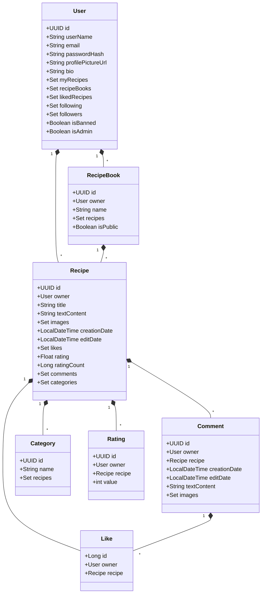

```mermaid
classDiagram
    User "1" *-- "*" Recipe
    User "1" *-- "*" RecipeBook

    RecipeBook "1" *-- "*" Recipe

    Recipe "1" *-- "" Like
    Recipe "1" *-- "*" Comment
    Recipe "1" *-- "*" Category
    Recipe "1" *-- "*" Rating

    Comment "1" *-- "*" Like

    class User {
        +UUID id
        +String userName
        +String email
        +String passwordHash
        +String profilePictureUrl
        +String bio
        +Set<Recipe> myRecipes
        +Set<RecipeBook> recipeBooks
        +Set<Recipe> likedRecipes
        +Set<User> following
        +Set<User> followers
        +Boolean isBanned
        +Boolean isAdmin
    }

    class RecipeBook {
        +UUID id
        +User owner
        +String name
        +Set<Recipe> recipes
        +Boolean isPublic
    }

    class Recipe {
        +UUID id
        +User owner
        +String title
        +String textContent
        +Set<String> images
        +LocalDateTime creationDate
        +LocalDateTime editDate
        +Set<Like> likes
        +Float rating
        +Long ratingCount
        +Set<Comment> comments
        +Set<Category> categories
    }

    class Like {
        +Long id
        +User owner
        +Recipe recipe
    }

    class Comment {
        +UUID id
        +User owner
        +Recipe recipe
        +LocalDateTime creationDate
        +LocalDateTime editDate
        +String textContent
        +Set<String> images
    }

    class Category {
        +UUID id
        +String name
        +Set<Recipe> recipes
    }

    class Rating {
        +UUID id
        +User owner
        +Recipe recipe
        +int value
    }
```

<!-- page break please? no? ok...-->

```mermaid
classDiagram
    CategoryController --> CategoryService
    CategoryService <|-- CategoryServiceImplementation

    LikeController --> LikeService
    LikeService <|-- LikeServiceImplementation

    RecipeBookController --> RecipeBookService
    RecipeBookService <|-- RecipeBookServiceImplementation

    RecipeController --> RecipeService
    RecipeService <|-- RecipeServiceImplementation

    UserController --> UserService
    UserService <|-- UserServiceImplementation

    CommentController --> CommentService
    CommentService <|-- CommentServiceImplementation

    AuthController --> AuthService
    AuthService <|-- AuthServiceImplementation

    ModerationController --> ModerationService
    ModerationService <|-- ModerationServiceImplementation


    class CategoryController {
    }

    class CategoryService {
    }

    class CategoryServiceImplementation{
    }

    class LikeController{
    }

    class LikeService{
    }

    class LikeServiceImplementation{
    }

    class RecipeBookController{
    }

    class RecipeBookService{
    }

    class RecipeBookServiceImplementation{
    }

    class CommentController{
    }

    class CommentService{
    }

    class CommentServiceImplementation{
    }

    class UserController{
    }

    class UserService{
    }

    class UserServiceImplementation{
    }

    class RecipeController{
    }

    class RecipeService{
    }

    class RecipeServiceImplementation{
    }

    class AuthController{
    }

    class AuthService{
    }

    class AuthServiceImplementation{
    }

    class ModerationController{
    }

    class ModerationService{
    }

    class ModerationServiceImplementation{
    }
```
